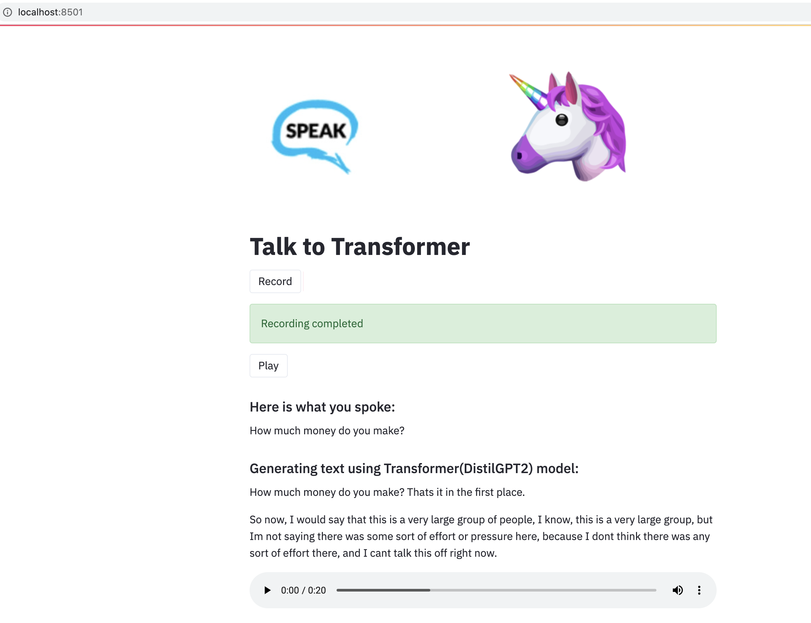

# Talk-To-Transformer

## Introduction
An application that talks back to you when you seed it with some words. Under the hood, a transformer model is used for text generation. 

This app does these 3 things in sequence:
1. Converts speech to text using [Wave2Vec](https://huggingface.co/transformers/model_doc/wav2vec2.html) model from Hunggingface
2. Text generation using [DistilGPT-2](https://huggingface.co/distilgpt2), which is another model from Huggingface library
3. Converts text to speech using the Tacotron model from [Coqui library](https://github.com/coqui-ai/TTS)

## What can this app do?
This app is inspired from the [pre-existing web-app](https://app.inferkit.com/demo), which is a text only version. This app takes it to the next level where you can talk and listen to the generated text.

## Setting up the project

### 1. Clone the repo

```console
$ git clone https://github.com/kumar-abhishek/fsdl-talk-to-transformer
$ cd fsdl-talk-to-transformer
```

### 2. Installation

> You can install the required packages using any **`one of the 3 options`** below. However, **`Option 1`** is well tested and recommended. If you have to use other options, you would likely have to tweak the list of versions/packages in environment.yml from Option 1. 

Please also note that since this has been developed and tested on a Mac OS, you may encounter some minor installation issues on other operating systems.

### Option 1: Using Conda - Recommended

- Download and install [miniconda](https://docs.conda.io/projects/conda/en/latest/user-guide/install/) or
  [anaconda](https://docs.anaconda.com/anaconda/install/) if you don't have conda installed in your system.

- Create a new environment 'tf' using the following command:


    ```console
    # if you need to install conda on ubuntu/debian based OS
    eval "$(/root/miniconda3/bin/conda shell.bash hook)" 
    
    $ conda env create -f environment.yml

    # to update the environment, make sure have already activated the environment
    conda env update --file environment.yml
    ```

    If an error like the one shown below occurs:

    ```console
    ResolvePackageNotFound:
        - appnope=0.1.0
        - libcxx=4.0.1
    ```

    Just remove those packages from the file `environment.yml` and rerun the above command. Then activate the
    environment by

    ```console
    $ conda activate tf
    ```

### Option 2: Using setup.sh

- If you face trouble installing packages, you may install using `setup.sh`. If you use bash shell instead of zsh, edit
  line 2 of `setup.sh` by replacing zsh with bash. i.e. 

  ```shell
  eval "$(conda shell.zsh hook)"
  ```

  Then run the following commands

    ```console
    $ chmod +x setup.sh
    $ ./setup.sh
    ```

### Option 3: Using Virtual Environment

- Install virtualenv using pip and create a virtual environment '.venv'

    ```console
    $ pip install virtualenv
    $ virtualenv .venv
    ```

- Activate the virtual environment '.venv' and install required packages

    ```console
    $ source .venv/bin/activate
    $ pip install -r requirements.txt
    ```

## Configuring the App (settings.py)

- First, check the info of the audio recording device of your system by running

    ```console
    $ python -m src.sound
    ```

    You will receive output something like this:

    ```console
   pygame 1.9.6
    Hello from the pygame community. https://www.pygame.org/contribute.html
    src.sound - INFO - List of System's Audio Devices configurations:
    src.sound - INFO - Number of audio devices: 2
    src.sound - INFO - [('index', 0), ('name', 'MacBook Pro Microphone'), ('maxInputChannels', 1), ('defaultSampleRate', 44100.0)]
    src.sound - INFO - [('index', 1), ('name', 'MacBook Pro Speakers'), ('maxInputChannels', 0), ('defaultSampleRate', 44100.0)]

    src.sound - INFO - Audio device configurations currently used
    src.sound - INFO - Default input device index = 0
    src.sound - INFO - Max input channels = 1
    src.sound - INFO - Default samplerate = 44100
    ```

- Check if the `index`, `maxInputChannels` and  `defaultSampleRate` of your recording device or microphone (eg. MacBook
  Pro Microphone) matches with the device configurations currently used (both displayed in the output). The
  configurations for my recording device is:

    ```console
    index = 0
    maxInputChannels = 1
    defaultSampleRate = 44100.0
    ```

- Open `settings.py` and modify the values accordingly in line numbers 38 to 40

    ```python
    # Audio configurations
    INPUT_DEVICE = 0
    MAX_INPUT_CHANNELS = 1  # Max input channels
    DEFAULT_SAMPLE_RATE = 44100   # Default sample rate of microphone or recording device
    ```

## Running the Talk to Transformer Webapp

- Execute the python file `app.py` using streamlit

    ```console
    $ streamlit run app.py
    ```

- The webapp is launched in your browser and opened automatically as shown below. You may also open it by visiting [http://localhost:8501](http://localhost:8501)

    <div align = 'center'>
        
    </div>

    > Click the above video to to go to YouTube and hear the sound as well.

- Click `Record` and say something. It records for 5 seconds(configurable) and saves the output wav file to `recording/recorded.wav`. 

- Click `Play` to listen to the recorded speech. 

- Click `Play generated text` to play the generated text

## Training the model (Optional)

If you want to experiment by training the model used for text generation(in generate_text.py file) yourself with your own data or the data used currently, follow the steps
below:

- Open the file notebooks/train_text_generator.ipynb in Google Colab(link at the top of the file) and run all the cells.
- You would have to save the trained model and use that model in generate_text.py instead of using the pre-trained model from huggingface library.

## Report Issues 
If you have any issues with the app, please report it here: [Issues](https://github.com/kumar-abhishek/fsdl-talk-to-transformer/issues)

## License

Talk-To-Transformer is licensed under the [GNU GPLv3](https://www.gnu.org/licenses/gpl-3.0.en.html) license.

credits: Heavily influenced from [this repo](https://github.com/ayushkumarshah/Guitar-Chords-recognition)